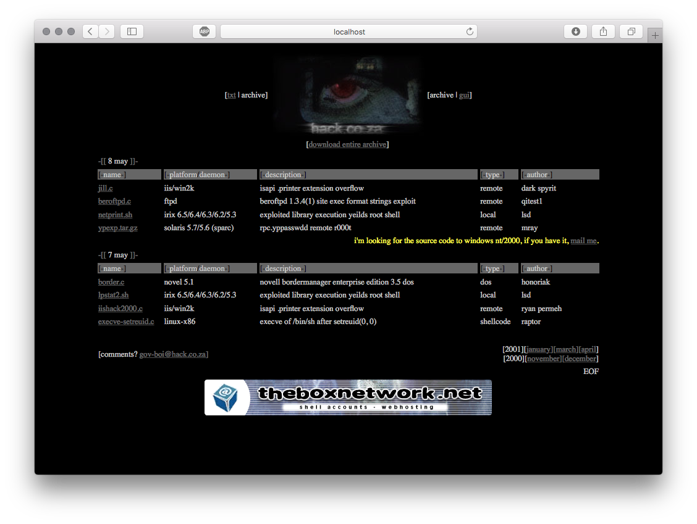

# Hack.co.za's website mirror
[](https://hub.docker.com/r/strm/mirror-hack.co.za/)

Just a mirror of hack.co.za website, for old times' sake !

If you want to run a local copy of this website, you can use [docker](https://docker.com)

```
docker run --rm -p 80:80 strm/mirror-hack.co.za
```

Then go to [localhost](http://localhost) and be nostalgic !



**Enjoy !**

